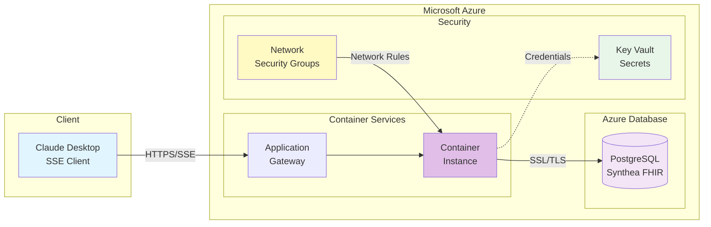

# Azure Deployment Guide (EXPERIMENTAL - UNTESTED)

⚠️ **WARNING: This deployment method is EXPERIMENTAL and has NOT been tested in production.**

This guide provides theoretical steps for deploying the Synthea FHIR MCP Server on Microsoft Azure. Community testing and feedback are welcome.

## Status: EXPERIMENTAL

- **Testing Status**: ❌ Not tested
- **Production Ready**: ❌ No
- **Community Feedback**: Needed

If you successfully deploy on Azure, please open an issue to share your experience!

## Architecture



## Prerequisites

- Azure Account with active subscription
- Azure CLI installed and configured
- Docker installed locally
- PostgreSQL database (Azure Database for PostgreSQL recommended)

## Database Setup (Azure Database for PostgreSQL)

1. Create a resource group:
```bash
az group create --name synthea-rg --location eastus
```

2. Create Azure Database for PostgreSQL:
```bash
az postgres flexible-server create \
  --resource-group synthea-rg \
  --name synthea-fhir-db \
  --location eastus \
  --admin-user postgres \
  --admin-password YOUR_SECURE_PASSWORD \
  --sku-name Standard_B1ms \
  --tier Burstable \
  --storage-size 32 \
  --version 13
```

3. Configure firewall rules:
```bash
# Allow Azure services
az postgres flexible-server firewall-rule create \
  --resource-group synthea-rg \
  --name synthea-fhir-db \
  --rule-name AllowAzureServices \
  --start-ip-address 0.0.0.0 \
  --end-ip-address 0.0.0.0
```

## Deployment Options

### Option 1: Azure Container Instances (Simplest)

1. Build and push to Azure Container Registry:
```bash
# Create container registry
az acr create --resource-group synthea-rg --name syntheamcpacr --sku Basic

# Login to ACR
az acr login --name syntheamcpacr

# Build and push
az acr build --registry syntheamcpacr --image synthea-mcp:latest .
```

2. Deploy to Container Instances:
```bash
az container create \
  --resource-group synthea-rg \
  --name synthea-mcp \
  --image syntheamcpacr.azurecr.io/synthea-mcp:latest \
  --cpu 1 \
  --memory 1 \
  --registry-login-server syntheamcpacr.azurecr.io \
  --registry-username $(az acr credential show --name syntheamcpacr --query username -o tsv) \
  --registry-password $(az acr credential show --name syntheamcpacr --query passwords[0].value -o tsv) \
  --dns-name-label synthea-mcp \
  --ports 8080 \
  --environment-variables \
    AZURE_POSTGRES_HOST=synthea-fhir-db.postgres.database.azure.com \
    DB_USER=postgres \
    DB_NAME=synthea \
  --secure-environment-variables \
    DB_PASSWORD=YOUR_SECURE_PASSWORD
```

### Option 2: Azure App Service

1. Create an App Service plan:
```bash
az appservice plan create \
  --name synthea-plan \
  --resource-group synthea-rg \
  --sku B1 \
  --is-linux
```

2. Create and deploy web app:
```bash
az webapp create \
  --resource-group synthea-rg \
  --plan synthea-plan \
  --name synthea-mcp-app \
  --deployment-container-image-name syntheamcpacr.azurecr.io/synthea-mcp:latest
```

3. Configure environment variables:
```bash
az webapp config appsettings set \
  --resource-group synthea-rg \
  --name synthea-mcp-app \
  --settings \
    AZURE_POSTGRES_HOST=synthea-fhir-db.postgres.database.azure.com \
    DB_USER=postgres \
    DB_PASSWORD=YOUR_SECURE_PASSWORD \
    DB_NAME=synthea \
    PORT=8080
```

### Option 3: Azure Kubernetes Service (AKS)

For production workloads, see the `k8s-deployment.yaml` file for Kubernetes deployment.

## Environment Variables

Required environment variables for Azure deployment:

```env
# Azure PostgreSQL Configuration
AZURE_POSTGRES_HOST=your-server.postgres.database.azure.com
AZURE_POSTGRES_PORT=5432
DB_USER=postgres
DB_PASSWORD=your_secure_password
DB_NAME=synthea

# Application Settings
PORT=8080

# Optional: Connection string format
# DATABASE_URL=postgresql://postgres@your-server:password@your-server.postgres.database.azure.com:5432/synthea?sslmode=require
```

## Security Considerations

⚠️ **IMPORTANT**: Since this is untested, pay special attention to:

1. **Network Security**:
   - Configure Network Security Groups (NSGs)
   - Use Private Endpoints for database connectivity
   - Enable SSL enforcement on PostgreSQL

2. **Secrets Management**:
   - Use Azure Key Vault for passwords
   - Use Managed Identities where possible
   - Avoid hardcoding credentials

3. **Access Control**:
   - Implement proper RBAC policies
   - Use Azure AD authentication when possible
   - Configure Application Gateway or Front Door for WAF

## Load Test Data

After deployment:

```bash
# Connect to your container/app
# Run the data generation scripts
python scripts/generate_synthea_data.py
python scripts/load_synthea_data.py --synthea-dir synthea/output
```

## Monitoring

Set up Azure Monitor:
- Application Insights for application monitoring
- Azure Database for PostgreSQL metrics
- Log Analytics workspace for centralized logging

## Cost Estimates

Approximate monthly costs (varies by region and usage):
- Azure Database for PostgreSQL (Burstable B1ms): ~$15-25
- Container Instances (1 vCPU, 1GB): ~$30-40
- App Service (B1): ~$50-60
- Data transfer: Variable

## Troubleshooting

Common issues (theoretical):

1. **Connection refused**: Check firewall rules and NSGs
2. **SSL connection error**: Ensure SSL is properly configured
3. **Authentication failed**: Verify username format (user@servername)
4. **Performance issues**: Consider scaling up or using connection pooling

## Contributing

**We need your help!** If you deploy this on Azure:

1. Test the deployment
2. Document any issues or changes needed
3. Open an issue or PR with your findings
4. Help us mark this as "tested" once verified

## Additional Resources

- [Azure Database for PostgreSQL Documentation](https://docs.microsoft.com/azure/postgresql/)
- [Azure Container Instances Documentation](https://docs.microsoft.com/azure/container-instances/)
- [Azure App Service Documentation](https://docs.microsoft.com/azure/app-service/)

## Disclaimer

This Azure deployment guide is provided as-is without warranty. It has NOT been tested in production. Use at your own risk and ensure proper security measures are in place.