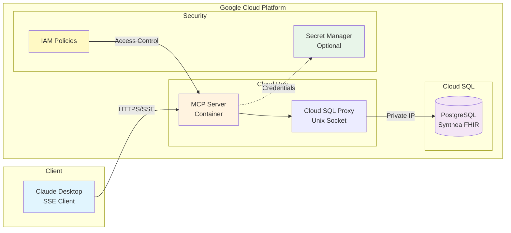

# Google Cloud Platform Deployment Guide (PRODUCTION READY)

✅ **This deployment method is TESTED and PRODUCTION READY.**

This is the primary deployment method for the Synthea FHIR MCP Server. It has been thoroughly tested and is actively used in production.

## Status: PRODUCTION READY

- **Testing Status**: ✅ Fully tested
- **Production Ready**: ✅ Yes
- **Current Deployment**: https://synthea-mcp-1095016408887.us-central1.run.app

## Quick Deploy

For detailed instructions, see the main [Deployment Guide](../../docs/DEPLOYMENT.md).

### Prerequisites
- Google Cloud Project with billing enabled
- gcloud CLI installed and configured
- Cloud SQL instance with Synthea data

### Quick Deployment Steps

1. **Set up environment**:
```bash
cp ../../.env.example .env
# Edit .env with your Cloud SQL connection details
source .env
```

2. **Deploy to Cloud Run**:
```bash
./deploy.sh
```

That's it! Your MCP server will be running on Cloud Run.

## Architecture



## Key Features

- **Serverless**: Automatic scaling with Cloud Run
- **Secure**: Cloud SQL Proxy for database connections
- **Managed**: Google handles infrastructure
- **Cost-effective**: Pay only for what you use

## Configuration

### Environment Variables (Production)
```env
CLOUD_SQL_CONNECTION_NAME=project:region:instance
DB_USER=demo_reader
DB_PASSWORD=your_password
DB_NAME=synthea
```

### Cloud Run Settings
- Memory: 512Mi
- CPU: 1
- Timeout: 300s
- Max instances: 10
- Min instances: 0 (scales to zero)

## Security

Production deployment includes:
- ✅ Cloud SQL Proxy for secure connections
- ✅ Secret Manager for credentials (optional)
- ✅ VPC connector for private networking (optional)
- ✅ Identity and Access Management (IAM)
- ✅ SSL/TLS encryption

## Monitoring

Cloud Run provides built-in monitoring:
- Request metrics
- Error rates
- Latency percentiles
- Container metrics
- Custom logs in Cloud Logging

## Cost

Typical monthly costs (based on moderate usage):
- Cloud Run: ~$5-20
- Cloud SQL (db-f1-micro): ~$15
- Network egress: Variable
- Total: ~$20-50/month

## Support

This deployment method is fully supported. For issues:
1. Check [Deployment Guide](../../docs/DEPLOYMENT.md)
2. Review Cloud Run logs
3. Open an issue on GitHub

## Additional Resources

- [Cloud Run Documentation](https://cloud.google.com/run/docs)
- [Cloud SQL Documentation](https://cloud.google.com/sql/docs)
- [Cloud SQL Proxy Guide](https://cloud.google.com/sql/docs/mysql/sql-proxy)