# System Architecture

This document provides a comprehensive overview of the Synthea FHIR MCP Server architecture, including system components, data flow, and deployment options.

## Table of Contents
- [System Overview](#system-overview)
- [Data Flow](#data-flow)
- [Component Details](#component-details)
- [Protocol Stack](#protocol-stack)
- [Multi-Cloud Deployment](#multi-cloud-deployment)
- [Security Architecture](#security-architecture)

## System Overview

The Synthea FHIR MCP Server enables Claude Desktop to query synthetic healthcare data through a standardized Model Context Protocol interface.

```mermaid
graph TB
    subgraph "User Interface Layer"
        USER[User]
        CD[Claude Desktop<br/>AI Assistant]
    end

    subgraph "Protocol Translation Layer"
        SG[Supergateway<br/>SSE→MCP Proxy]
    end

    subgraph "MCP Server Layer"
        MCP[MCP Server<br/>Python/FastMCP]
        TOOLS[FHIR Tools<br/>11 Specialized Functions]
        QUERY[Query Engine<br/>JSONB Processing]
    end

    subgraph "Data Layer"
        PG[(PostgreSQL Database)]
        FHIR[FHIR Resources<br/>Patients, Observations,<br/>Conditions, etc.]
    end

    USER -->|Natural Language| CD
    CD -->|MCP Protocol| SG
    SG -->|SSE Connection| MCP
    MCP --> TOOLS
    TOOLS --> QUERY
    QUERY -->|SQL/JSONB| PG
    PG --> FHIR

    style USER fill:#e3f2fd
    style CD fill:#e1f5fe
    style MCP fill:#fff3e0
    style PG fill:#f3e5f5
```

## Data Flow

Detailed sequence of how a medical query flows through the system:

## Component Details

### MCP Tools

The server provides 11 specialized FHIR query tools:

### Database Schema

FHIR resources are stored as JSONB in PostgreSQL:

## Protocol Stack

Communication protocols used in the system:

## Multi-Cloud Deployment

### Production (Google Cloud Platform)

### Experimental Deployments

## Security Architecture

### Authentication & Authorization Flow

### Security Layers

## Performance Considerations

### Query Optimization

## Scalability

### Auto-scaling Architecture

## Development Workflow

### Local Development Setup

## Data Generation Pipeline

### Synthea Data Flow

## Future Architecture Considerations

### Planned Enhancements

## Resources

- [MCP Protocol Specification](https://github.com/modelcontextprotocol/specification)
- [FHIR R4 Documentation](https://hl7.org/fhir/R4/)
- [Synthea Patient Generator](https://github.com/synthetichealth/synthea)
- [Cloud Run Documentation](https://cloud.google.com/run/docs)
- [PostgreSQL JSONB Guide](https://www.postgresql.org/docs/current/datatype-json.html)